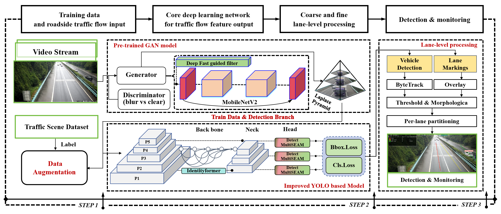

<div align="center" id="roadvision">
<a href="#" title="RoadVision">
  
</a>

🚦 **RoadVision** —— 基于路侧相机的车道级交通检测与监测感知系统  
Road-side vision based perception system for traffic detection and lane-level monitoring

[]()
[]()
[]()
[]()
[]()

</div>

> 本项目以 **车道级感知 / 易部署 / 便于扩展** 为目标，面向高速与城市快速路场景。

---

## 📑 快速导航

<div align="center">

| [🎯 项目简介](#-项目简介) | [✨ 核心功能](#-核心功能) | [⚙️ 环境与依赖](#️-环境与依赖) | [🚀 快速开始](#-快速开始) | [📄 许可证](#-许可证) | [📚 引用与致谢](#-引用与致谢)  |
| :----------------------: | :----------------------: | :---------------------------: | :----------------------: |  :---------------------------: | :----------------------: |
</div>

- 感谢所有参与路测、帮忙标注和协助调参的同学，你们的每一条反馈都在推动 RoadVision 变得更实用 😉  
- 如果本项目对你有帮助，欢迎 **Star / Fork / Issue**，你的支持是我持续维护与开源的动力 🚀  

---

## 🎯 项目简介

**RoadVision** 聚焦于 **路侧相机** 场景下的交通目标检测与监测：

- 面向 **高速公路 / 城市快速路 / BRT 专用道** 等固定机位监控画面；
- 基于 **深度学习检测器（YOLO 系列）+ 上层几何与车道逻辑**，实现 **车道级统计与监测**；
- 支持后续扩展：车流量统计、平均车速估计、应急车道占用检测、异常停车检测等。

> The project aims to build a perception system for traffic detection and monitoring based on road-side vision cameras, enabling lane-level analysis and long-term traffic observation.

---

## ✨ 核心功能

### 1. 车辆与目标检测

- 基于 **Ultralytics YOLO (>= 8.3.199)** 的多类别目标检测：
  - 🚗 小客车 / 🚙 SUV / 🚛 货车 / 🚌 公交车等
- 针对路侧视角做了 **模糊场景与远距离小目标感知增强**（MutiSEAM / IdentityFormer / Improved DeblurGANv2）

### 2. 车道级交通监测

- 支持将检测目标投影到 **预定义车道区域**，实现：
  - 单车道车辆计数
  - 每车道占有率 / 车辆密度估计
  - 车道级轨迹可视化与热力图统计

### 3. 可视化与 GUI（基于 PyQt）

- 基于 **PyQt** 构建简易/实验型可视化界面（如已实现）：
  - 实时视频播放与检测结果叠加
  - 车道区域配置与调试
---

## ⚙️ 环境与依赖

### 操作系统

- ✅ 已在 **Ubuntu 20.04 / 24.04** 上通过测试  
- 其他 Linux 发行版理论上也可运行，但未系统验证

### 推荐环境：conda + Python 3.10

```bash
# 创建虚拟环境
conda create -n roadvision python=3.10
conda activate roadvision

# 安装依赖
python -m pip install -r requirements.txt
```
---

## 🚀 快速开始
```bash
conda activate roadvision
python Software.py
```
---

## 📄 许可证

Ultralytics offers two licensing options to suit different needs:

- **AGPL-3.0 License**: This [OSI-approved](https://opensource.org/license) open-source license is perfect for students, researchers, and enthusiasts. It encourages open collaboration and knowledge sharing. See the [LICENSE](https://github.com/ultralytics/ultralytics/blob/main/LICENSE) file for full details.
- **Ultralytics Enterprise License**: Designed for commercial use, this license allows for the seamless integration of Ultralytics software and AI models into commercial products and services, bypassing the open-source requirements of AGPL-3.0. If your use case involves commercial deployment, please contact us via [Ultralytics Licensing](https://www.ultralytics.com/license).


## 📚 引用与致谢

本项目在检测与图像增强模块中使用 / 参考了以下开源工作，如在论文或报告中使用 RoadVision，建议一并引用原作者成果。

The code was taken from <a href="">https://github.com/KupynOrest/RestoreGAN</a> and <a href="">https://github.com/ultralytics/ultralytics</a>

```
@InProceedings{Kupyn_2019_ICCV,
author = {Orest Kupyn and Tetiana Martyniuk and Junru Wu and Zhangyang Wang},
title = {DeblurGAN-v2: Deblurring (Orders-of-Magnitude) Faster and Better},
booktitle = {The IEEE International Conference on Computer Vision (ICCV)},
month = {Oct},
year = {2019}
}

@software{Jocher_Ultralytics_YOLO_2023,
author = {Jocher, Glenn and Qiu, Jing and Chaurasia, Ayush},
license = {AGPL-3.0},
month = jan,
title = {{Ultralytics YOLO}},
url = {https://github.com/ultralytics/ultralytics},
version = {8.0.0},
year = {2023}
}
```
